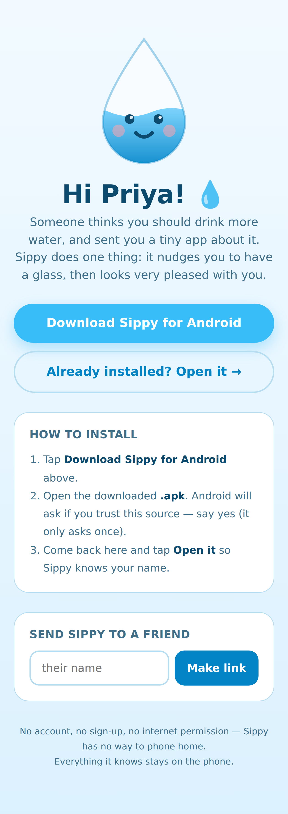

# Sippy 💧

A very cute Android app that does exactly one thing: remind you to drink water.

No account. No sign-up. No settings maze. No `INTERNET` permission — Sippy has
no way to phone home, and everything it knows stays on the phone.

The personalised invite page a friend sees when you send them their link:



## Why an APK and not a PWA

A PWA can *receive* notifications on Android, but it cannot **schedule** them.
The Notification Triggers API (`showTrigger` / `TimestampTrigger`) never shipped
— it was an origin trial that was shelved, and scheduled local notifications are
still not part of the web platform. So a web version of Sippy would need:

- a server holding push subscriptions,
- a cron job firing every interval, for every user, forever, and
- a working network connection on the phone at the exact moment of the nudge,

…and it would *still* get silently delayed or dropped by Doze and by the
aggressive battery killers that Xiaomi, Oppo, Vivo and friends ship by default.

A native app schedules an `AlarmManager` alarm the OS itself is responsible for
honouring. It works offline, on a plane, with the app force-stopped. For
something whose entire job is "fire at the right time", that's the difference
between a toy and a thing you'd actually rely on.

## Personalised invite links

You can send someone a link with their name in it:

```
https://wahabshaikh.github.io/water-reminder/?name=Priya
```

That page greets them by name, hands them the APK, and — once installed — an
**Open it →** button fires `sippy://hi?name=Priya`, so the app already knows who
they are before they've typed anything.

The landing page also has a **Send Sippy to a friend** box that builds these
links for you, so you don't have to hand-edit URLs.

Two deliberate limits on the name:

- It only ever *pre-fills* onboarding. Once someone has set themselves up, a
  stray link can't rename them behind their back.
- The page echoes it as text, never as HTML.

If someone installs without ever tapping the link, onboarding just asks for
their name. Nothing breaks.

## What it does

- A gentle nudge every N minutes, only between your waking hours — never at 3am.
- **I drank it ✨** right on the notification, so a glass can be logged without
  opening the app.
- A droplet mascot that fills as you go, blinks, and grins when you hit the goal.
- A streak counter, for the people who are motivated by streaks.
- Reschedules itself after a reboot, an app update, or a clock/timezone change.

Tunable: daily goal, nudge interval, start hour, wind-down hour, and your name.

## Building it

```bash
export ANDROID_HOME=/path/to/android-sdk
./gradlew assembleRelease
# → app/build/outputs/apk/release/app-release.apk
```

Tests (the scheduling-window logic, which is where the edge cases live):

```bash
./gradlew testReleaseUnitTest
```

## Releasing

Push a tag and CI builds, tests, and publishes the APK as `sippy.apk`:

```bash
git tag v1.0 && git push origin v1.0
```

The landing page links to
`releases/latest/download/sippy.apk`, so it starts working the moment the first
tagged release exists — and keeps pointing at the newest one after that.

To serve the page, enable **GitHub Pages → Deploy from branch → `/docs`** in the
repository settings.

### About the signing key

`keystore/sippy.jks` is checked in on purpose (password `sippysippy`). Android
refuses to install an update signed by a different key than the installed
version, so a stable key is what lets someone upgrade Sippy instead of having to
uninstall and lose their streak.

This is the right trade for a hobby app you hand to friends, and the wrong one
for anything on the Play Store: anybody with this repo can sign an APK that a
phone will accept as an update to Sippy. To use your own key instead, set
`SIPPY_KEYSTORE`, `SIPPY_KEYSTORE_PASSWORD`, `SIPPY_KEY_ALIAS`, and
`SIPPY_KEY_PASSWORD`.

## Layout

| Path | What's in it |
| --- | --- |
| `app/src/main/java/com/sippy/app/Reminders.kt` | Works out when the next nudge lands |
| `app/src/main/java/com/sippy/app/ReminderReceiver.kt` | Fires the nudge; handles its action button |
| `app/src/main/java/com/sippy/app/Prefs.kt` | The handful of things Sippy remembers |
| `app/src/main/java/com/sippy/app/ui/Mascot.kt` | The droplet, drawn and animated in Compose |
| `docs/index.html` | Personalised landing page + link builder |
